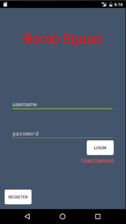
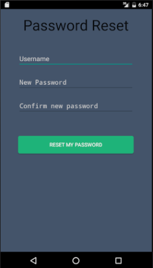
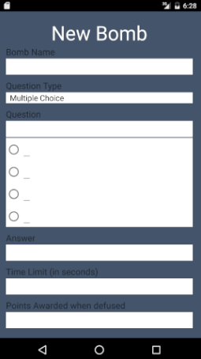
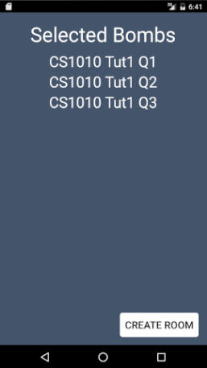
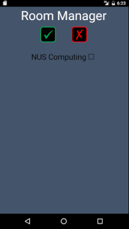
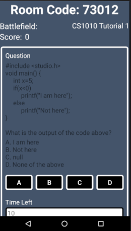

# Bomb Squad

 
 

 
Bomb Squad is an android mobile application, adpated from "The Bomb Game" commonly played during camps. This project is aimed at facilitating the answering of questions posted by tutor in class, and possibly extending it to a game that can be casually played among friends.
 
 
 
 
 
 
**Features**
 
- [x] Register new account
- [x] Login
- [x] Create Room
- [x] Enter Room
- [x] Manage Room
- [x] Create new bomb
 
 
 

