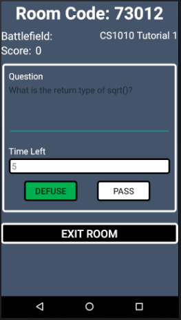

# 

 
 
Bomb Squad is a multiplayer android mobile quiz game, adpated from "The Bomb Game" commonly played during camps. This project is aimed at facilitating the answering of questions posted by tutor in class, and possibly extending it to a game that can be casually played among friends.
 
 
A prevalent problem is that students are reluctant to answer questions during lectures, tutorials or lessons in general. This results in the tutor’s inability to gauge the class’ level of understanding and the students’ doubt not clarified. Hence to motivate students to answer question during class and to inject the element of fun into the process, we propose the idea of “Bomb Squad”. 
 
 
Before the lesson, tutor can input the questions into the app and create a game room. During the lesson, students will be given the room code to join the room and play the game through their mobile app. The questions will be thrown to a random student (or selected student based on the option chosen by the tutor) as the “bomb”. If the question is in the form of MCQ, the student will just have to select the correct answer within the time limit in order to defuse the bomb. Else if the question is in the form of an open ended question, the student will have to answer directly to the tutor who posted the question and if the answer is correct, the tutor will defuse the bomb through his/her app. Student then gain points for correctly answering the question.
 
 
In the event that the student A does not know the answer for the question, he/she can choose to pass it on to the next student, Student B, by pressing the pass button, or it can be “random” where the bomb will be passed on to a random person. Student A name will then be removed from this round as he/she does not know the answer. 
 
 
A maximum of X passes can be made before the bomb explodes, where X is predetermined by the tutor. If the bomb explodes, the student possessing the bomb at the time would have their points deducted. When the bomb explodes or is defused, the round ends and all player will be reinstated to join the next round.
 
 
### **Features**
 
- [x] Register new account
- [x] Login
- [x] Create Room
- [x] Enter Room
- [x] Manage Room
- [x] Create new bomb
 
 
 

